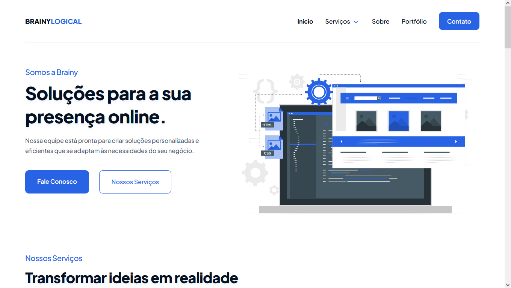

<h1 style="padding-top: 20px; padding-bottom: 20px;">
  
  
 (Web Development Agency) 

</h1>

<h2 style="border-bottom:none;">ABOUT 📘</h2>

Brainy Logical is a technology company dedicated to providing innovative and high-quality solutions for everyone. The purpose of creating the site is to present my projects and offer Web Development services.

<h2 style="border-bottom:none;">LIVE PREVIEW 👁‍🗨</h2>

WEBSITE: [https://brainylogical.com/](https://brainylogical.com/)

<h2 style="border-bottom:none; padding-top: 16px;">SCREENSHOTS #️⃣</h2>

Desktop

Mobile

<h2 style="border-bottom:none;">TECHNOLOGIES AND TOOLS 🔨👨‍💻</h2>

<h3>- Frontend</h3>

- [Vue.js](https://vuejs.org/)
- [Vuex](https://vuex.vuejs.org/)
- [Vue Router](https://router.vuejs.org/)
- [Sass (SCSS)](https://sass-lang.com/)

<h3>- Backend</h3>

- [Node.js](https://nodejs.org/en)
- [Express](https://expressjs.com/)
- [MySQL](https://www.mysql.com/)

<h3>- Deploy</h3>

- [Conteige Cloud](https://conteige.cloud/)

<h2>CONTACT ME 📩</h2>

- [Linkedin](https://www.linkedin.com/in/gregorydom/)
- [Github](https://github.com/gregdom)
- [Email](gregory_dom@hotmail.com)
